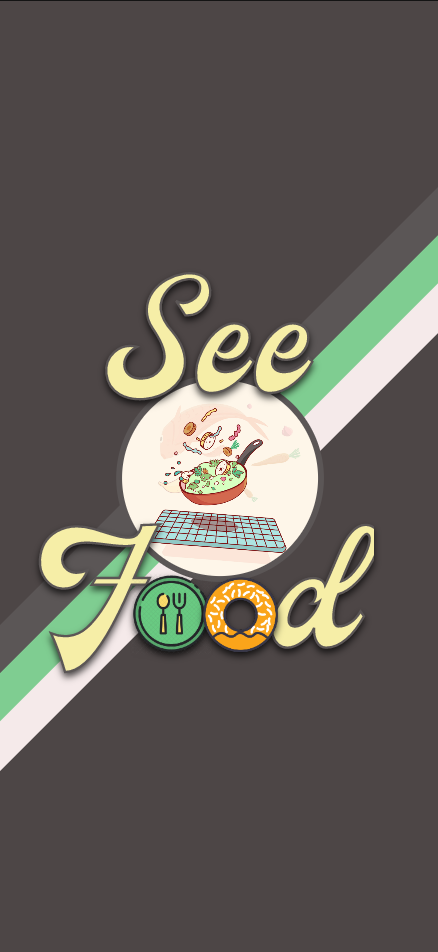
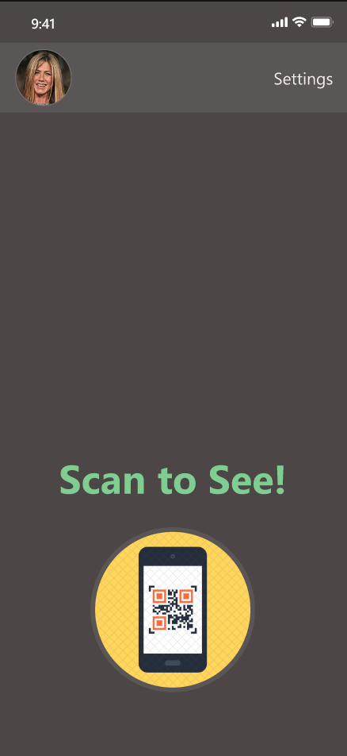
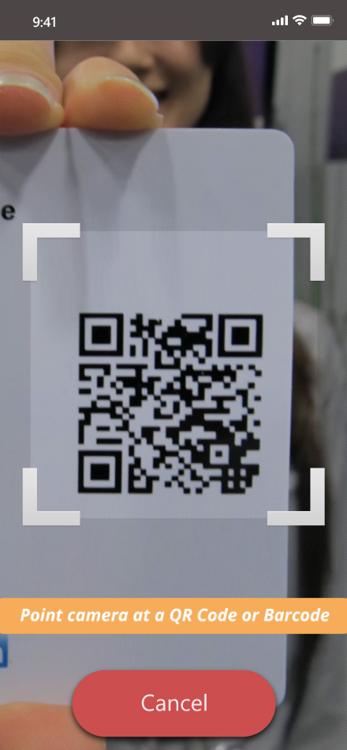
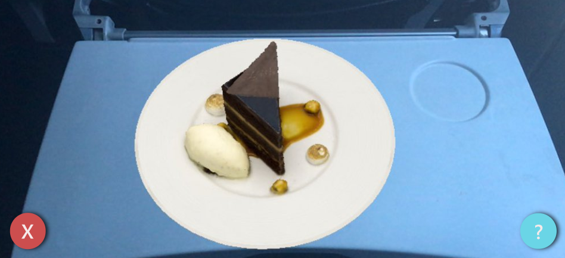
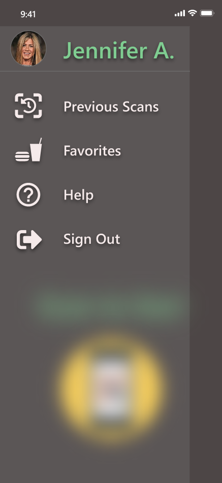

# SeeFood: See food before you order!

## Team:
- Aditya Dutta
- Michael Wells
- Gabriel Kalil

## Purpose of the app
The purpose of the application is to allow people to see augmented reality versions of what food would look like from a menu via QR codes. This can be used either in a restaurant or at home by scanning a QR code on a menu or searching for a specific meal online. 

## Areas of interest
This will incorporate primarily the use of AR for creating a unique application. Additional areas that will be required are the camera and QR code scanning plugins.

## Mocks for each screen

1. Home screen

2. QR scanning screen

3. Display image of what a food item would look like when on screen

4. Image of the library of previous searches.

 

[Adobe XD Mockup](https://xd.adobe.com/view/63566d52-92bd-40c9-6af6-45f366edf415-1567/?fullscreen&hints=off)

## Value of the app for the user
There can be large language barriers when in a restaurant where the language of the menu is not a language someone knows. This app can help make decisions by showing the user what the food will look like in real-world space and help further push people to try new things. While traveling, this can be extremely helpful as language barriers are common when outside of your home country.

The rise of online food delivery services like Uber Eats and Skip The Dishes has resulted in a massive increase in the number of people who stay in and decrease the number of people who eat out. This can cause some people to try less new food options because when ordering online, you cannot ask a server about portion size or how the meal will turn out. This application can be used to display how a dish will look in the comfort of your own home.

## Outline the users typical path through out the app
The user will open an application on the iPhone. They can open up a camera that scans QR codes from a home screen. This camera will open up and will include a large scanning area to help the user center on the camera. When they scan a QR code, they will see a visual display of the food in real-world space via AR on their phone. They can return to the home screen via a back button from the camera screen. They can also access a library of previous scans from the home screen. The application will store 5-10 of their recent searches which can be displayed again via the camera. 

## Use cases.
1. Someone is in a restaurant in a foreign country where they do not speak the local language. They get the menu but do not know what to order as they cannot read the language on the menu and it does not have many images of the different food items. With this application, the user can scan a QR code on the menu and see what the meal would look like in the real-world right in front of them on their phone. This will give them an idea of what the meal will be and also how large it will be. 

2. Someone is feeling sick and stays home for a full week. They want something to eat but don’t want to order too much food as they’re an environmentalist who hates wasting anything. When they go on to an online delivery application, they can see 1000s of food options but they won’t be able to tell how large they will be. Using this application, the user would be able to display how large the meal will be in the comfort of their own home, helping inform them of their purchasing decision. 
